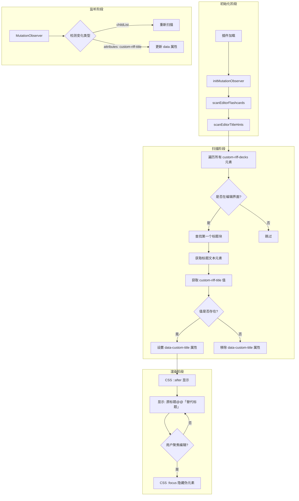

# 编辑界面闪卡标题提示功能实现计划

## 功能概述

在编辑界面中，当闪卡存在 `custom-riff-title` 属性时，在闪卡的第一个标题块末尾显示替代标题，格式为：`原标题@@「替代标题」`。当用户编辑标题时，替代标题自动隐藏。

## 技术方案

### 核心实现方式

- **显示方式**：CSS 伪元素 `::after` + `data-*` 属性
- **隐藏机制**：`:focus` 选择器，编辑时自动隐藏
- **检测机制**：复用现有的 MutationObserver

### 架构设计



## 实现步骤

### 步骤 1：添加常量定义

在 [`constants.ts`](src/features/flashcard-title-editor/constants.ts) 中添加：

```typescript
// ========== 编辑界面标题提示相关 ==========
// 用于存储替代标题的 data 属性名
export const EDITOR_TITLE_HINT_ATTR = 'data-custom-title';
// 标题提示格式前缀
export const TITLE_HINT_PREFIX = '@@「';
// 标题提示格式后缀
export const TITLE_HINT_SUFFIX = '」';
```

### 步骤 2：创建 CSS 样式

在 [`index.scss`](src/index.scss) 中添加或动态注入：

```scss
// 编辑界面闪卡标题提示样式
[data-custom-title]::after {
  content: '@@「' attr(data-custom-title) '」';
  color: var(--b3-card-info-color, #5b80a8);
  font-size: 0.85em;
  opacity: 0.8;
  margin-left: 2px;
}

// 编辑时隐藏提示
[data-custom-title]:focus::after {
  content: none;
}

// 兼容:focus-within（如果焦点在父元素上）
[data-custom-title]:focus-within::after {
  content: none;
}
```

### 步骤 3：实现扫描和设置逻辑

在 [`index.ts`](src/features/flashcard-title-editor/index.ts) 中添加：

```typescript
/**
 * 扫描编辑界面的闪卡标题提示
 */
const scanEditorTitleHints = () => {
  // 查找所有闪卡
  const cardElements = document.querySelectorAll<HTMLElement>('[custom-riff-decks]');
  
  cardElements.forEach((cardElement) => {
    // 检查是否在编辑界面
    if (!isElementInEditorInterface(cardElement)) {
      return;
    }
    
    // 查找第一个标题块
    const headingElement = cardElement.querySelector<HTMLElement>('[data-type="NodeHeading"]');
    if (!headingElement) {
      return;
    }
    
    // 获取标题文本元素（contenteditable）
    const textElement = headingElement.querySelector<HTMLElement>('div[contenteditable="true"]');
    if (!textElement) {
      return;
    }
    
    // 获取 custom-riff-title 值
    const customTitle = cardElement.getAttribute('custom-riff-title');
    
    if (customTitle && customTitle.trim()) {
      // 设置 data 属性，CSS 会自动显示伪元素
      textElement.setAttribute(EDITOR_TITLE_HINT_ATTR, customTitle.trim());
    } else {
      // 移除 data 属性
      textElement.removeAttribute(EDITOR_TITLE_HINT_ATTR);
    }
  });
};

/**
 * 检查元素是否在编辑界面
 */
const isElementInEditorInterface = (element: HTMLElement): boolean => {
  let parent = element.parentElement;
  while (parent) {
    if (parent.getAttribute('data-loading') === 'finished') {
      return true;
    }
    parent = parent.parentElement;
  }
  return false;
};
```

### 步骤 4：修改 MutationObserver 监听

修改 [`initMutationObserver`](src/features/flashcard-title-editor/index.ts:43) 函数，添加对标题提示的扫描：

```typescript
const initMutationObserver = () => {
  editorObserver = new MutationObserver((mutations) => {
    let shouldScan = false;
    let shouldScanTitleHints = false;
    
    for (const mutation of mutations) {
      if (mutation.type === 'childList' && mutation.addedNodes.length > 0) {
        for (const node of Array.from(mutation.addedNodes)) {
          if (node instanceof HTMLElement) {
            if (node.classList?.contains('protyle-wysiwyg') || 
                node.querySelector?.('.protyle-wysiwyg') ||
                node.hasAttribute?.('custom-riff-decks')) {
              shouldScan = true;
              shouldScanTitleHints = true;
              break;
            }
          }
        }
      }
      
      // 监听 custom-riff-title 属性变化
      if (mutation.type === 'attributes') {
        if (mutation.attributeName === 'custom-riff-decks' || 
            mutation.attributeName === 'data-node-id') {
          shouldScan = true;
          shouldScanTitleHints = true;
        }
        if (mutation.attributeName === 'custom-riff-title') {
          shouldScanTitleHints = true;
        }
      }
      
      if (shouldScan && shouldScanTitleHints) break;
    }
    
    if (shouldScan) {
      scanEditorFlashcards();
    }
    if (shouldScanTitleHints) {
      scanEditorTitleHints();
    }
  });

  editorObserver.observe(document.body, {
    childList: true,
    subtree: true,
    attributes: true,
    attributeFilter: ['custom-riff-decks', 'data-node-id', 'custom-riff-title']
  });

  scanEditorFlashcards();
  scanEditorTitleHints(); // 初始扫描
};
```

### 步骤 5：清理逻辑

在 [`cleanup`](src/features/flashcard-title-editor/index.ts) 函数中添加清理：

```typescript
export const cleanup = () => {
  // ... 现有清理代码 ...
  
  // 移除所有 data-custom-title 属性
  document.querySelectorAll(`[${EDITOR_TITLE_HINT_ATTR}]`).forEach((el) => {
    el.removeAttribute(EDITOR_TITLE_HINT_ATTR);
  });
};
```

## 文件修改清单

| 文件 | 修改内容 |
|------|----------|
| [`constants.ts`](src/features/flashcard-title-editor/constants.ts) | 添加 `EDITOR_TITLE_HINT_ATTR` 常量 |
| [`index.ts`](src/features/flashcard-title-editor/index.ts) | 添加 `scanEditorTitleHints`、`isElementInEditorInterface` 函数，修改 `initMutationObserver`、`cleanup` |
| [`index.scss`](src/index.scss) | 添加 CSS 伪元素样式 |

## 效果预览

```
正常状态：
┌──────────────────────────────────────┐
│ 什么是闭包？@@「理解闭包的概念」        │
└──────────────────────────────────────┘

编辑状态（聚焦时）：
┌──────────────────────────────────────┐
│ 什么是闭包？|                          │  <- 光标，替代标题隐藏
└──────────────────────────────────────┘
```

## 注意事项

1. **性能考虑**：MutationObserver 已经存在，只是扩展了监听范围，对性能影响很小
2. **防抖处理**：如需频繁触发，可考虑添加防抖机制（300ms）
3. **样式隔离**：CSS 使用特定属性选择器，不会影响其他元素
4. **兼容性**：`:focus` 和 `::after` 在现代浏览器中广泛支持

## 测试用例

1. **基本显示**：打开包含 `custom-riff-title` 的闪卡，确认标题末尾显示替代标题
2. **编辑隐藏**：点击标题进入编辑，确认替代标题消失
3. **退出恢复**：编辑完成后失焦，确认替代标题重新显示
4. **属性更新**：通过对话框修改 `custom-riff-title`，确认显示实时更新
5. **属性清空**：删除 `custom-riff-title`，确认替代标题不再显示
